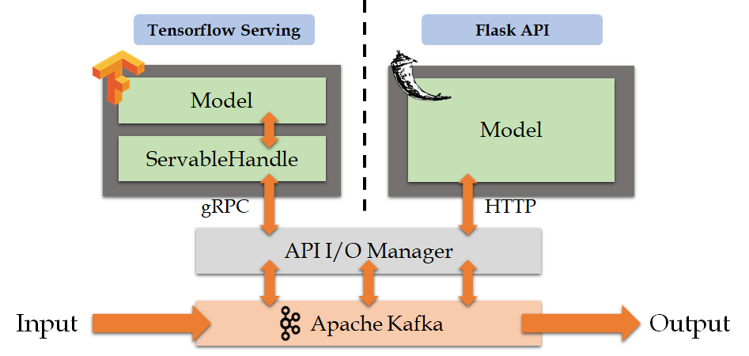

# Inference Manager
 
서빙한 딥러닝 모델과 실시간 데이터를 받는 카프카 사이에 중간 통로 역할을 하는 모델 

### 동작 구조   

<p align="center">

데이터가 카프카를 통해 입력되면, `API I/O Manager`를 통해 API를 실행하며 입력 데이터를 POST 전송한다.
서빙 모델에 성공적으로 전송했으면, 추론 결과가 받아질 것이고 이를 다시 카프카로 출력한다.

딥러닝 모델은 텐서플로우 서빙(Tensorflow Serving) 및 플라스크(Flask) API를 사용하여 서빙한다.

### 데이터 형태

##### 입력데이터
```
{
    "instances" : []
}
```
##### 출력데이터
```$xslt
{
    "predictions" : []
}
```

### 실행방법   

모델을 실행하기 전데 APIIOManager 클래스에서 본인의 카프카 bootstrap 정보를 입력해야한다.
```java
public static void main(String[] args) {
    String bootstrap = "";
    String inputTopic = args[0];
    String outputTopic = args[1];
    String servingAPI = args[2];

    APIExecutor inputConsumer = new APIExecutor(bootstrap, inputTopic, outputTopic).load(servingAPI);
    inputConsumer.consume();
}
```
bootstrap 변수에 카프카 정보를 입력하고, 프로젝트를 install 하여 jar 파일을 생성한다.
jar파일 실행은 다음과 같다. 실행은 서빙 모델이 먼저 실행되어야 한다.
```$xslt
$ java -jar Model-API-Executor-1.0-SNAPSHOT-jar-with-dependencies.jar <KAFKA_INPUT> <KAFKA_OUTPUT> <API_ADDRESS>
```
- `<KAFKA_INPUT>` : 카프카에서 데이터가 입력되는 토픽의 이름
- `<KAFKA_OUTPUT>` : 추론된 결과를 카프카로 출력할 토픽의 이름
- `<API_ADDRESS>` : 서빙 모델의 API 주소
